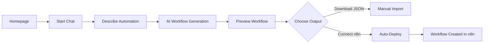

# Product Requirements Document (PRD)

**Product Name:** n8n Workflow Generator (AI-Powered Automation Builder)
**Version:** 1.0 (MVP)
**Author:** Product Management Team
**Date:** January 2024
**Status:** Draft

---

## 1. Executive Summary

**Vision:**
Empower anyone to build and deploy production-ready n8n workflows using natural language—no code, no friction.

**Problem:**
Creating workflows in n8n today is manual, slow, and requires technical knowledge. Non-technical users are blocked, and technical users waste time on repetitive tasks.

**Solution:**
A micro-SaaS that converts plain English descriptions into importable n8n workflows via Claude's API. The generated workflows include embedded documentation, error handling, and are ready for deployment.

---

## 2. Goals & Objectives

| Goal                                  | Success Metric                           |
| ------------------------------------- | ---------------------------------------- |
| Reduce time to first working workflow | < 2 minutes from input to deployment     |
| Support non-technical users           | 80% of beta users report ease of use     |
| Ensure production-readiness           | 100% of workflows include error handling |
| Simplify deployment                   | Enable 1-click deployment to user's n8n  |

---

## 3. Target Audience

**Primary Users:**

* Citizen developers
* Startup founders
* Marketing teams
* Operations managers

**Secondary Users:**

* n8n beginners
* Technical users looking to save time
* Consultants building client workflows

---

## 4. Key Features (MVP Scope)

| Feature                         | Description                                                      |
| ------------------------------- | ---------------------------------------------------------------- |
| Conversational Workflow Builder | Natural language interface to describe automation needs          |
| AI-Powered Workflow Generation  | Claude API generates nodes, connections, and logic               |
| JSON Export                     | Download workflow JSON without account                           |
| n8n Instance Integration        | Connect self-hosted/cloud n8n instance via API or OAuth          |
| 1-Click Auto-Deployment         | Automatically create and push workflow to connected n8n          |
| Embedded Documentation          | Explanations and comments included inside the generated workflow |
| Error Handling Included         | Each workflow includes basic error handling nodes                |
| Credential Placeholders         | Auto-created placeholders for credentials                        |
| Preview and Confirmation Screen | View and edit before export or deployment                        |

---

## 5. User Journey

### Flow Diagram



### Stages

1. **Discovery**

   * Landing page explains benefits and includes demo
   * Clear CTA to "Start Building"

2. **Engagement**

   * User enters workflow goal in chat
   * AI responds with questions (if needed) for clarification

3. **Generation**

   * Claude API returns generated workflow
   * Workflow displayed with summary and preview

4. **Output Options**

   * **Download JSON**: Save and manually import to n8n
   * **Connect n8n**: Use OAuth/API key for auto-deployment

5. **Deployment**

   * One-click deploy to user's n8n instance
   * User redirected to activate and connect credentials

---

## 6. Technical Requirements

### Integration with Claude API

* Prompt engineering and parsing of natural language
* Workflow generation must include:

  * Nodes
  * Connections
  * Settings
  * Documentation
  * Required credentials

### n8n Deployment API

**Auth Support:**

* OAuth 2.0 for n8n cloud
* API key support for self-hosted users

**Workflow Deployment Logic (Pseudocode):**

```javascript
// Deploy workflow to n8n instance
async function deployToN8n(workflow, creds) {
  const client = await authenticate(creds);
  const response = await client.createWorkflow({...});
  for (const cred of workflow.requiredCredentials) {
    await client.createCredentialPlaceholder({...});
  }
  return { id: response.id, url: `${creds.instanceUrl}/workflow/${response.id}` };
}
```

---

## 7. Non-Functional Requirements

| Requirement     | Detail                                                         |
| --------------- | -------------------------------------------------------------- |
| Performance     | Workflow generated in under 10 seconds                         |
| Security        | OAuth/API key encryption; no credential storage on our servers |
| Availability    | 99% uptime for generation and deployment endpoints             |
| Compatibility   | Must support latest stable version of n8n                      |
| Maintainability | Workflows versioned internally for rollback                    |

---

## 8. Out of Scope (MVP)

* Full user authentication or dashboard
* Workflow analytics or reporting
* Advanced credential handling (OAuth for individual services)
* Custom node creation

---

## 9. Future Enhancements

* User accounts and saved workflows
* Prompt library for common automation use cases
* Workflow metrics and performance insights
* Shared templates/community gallery 